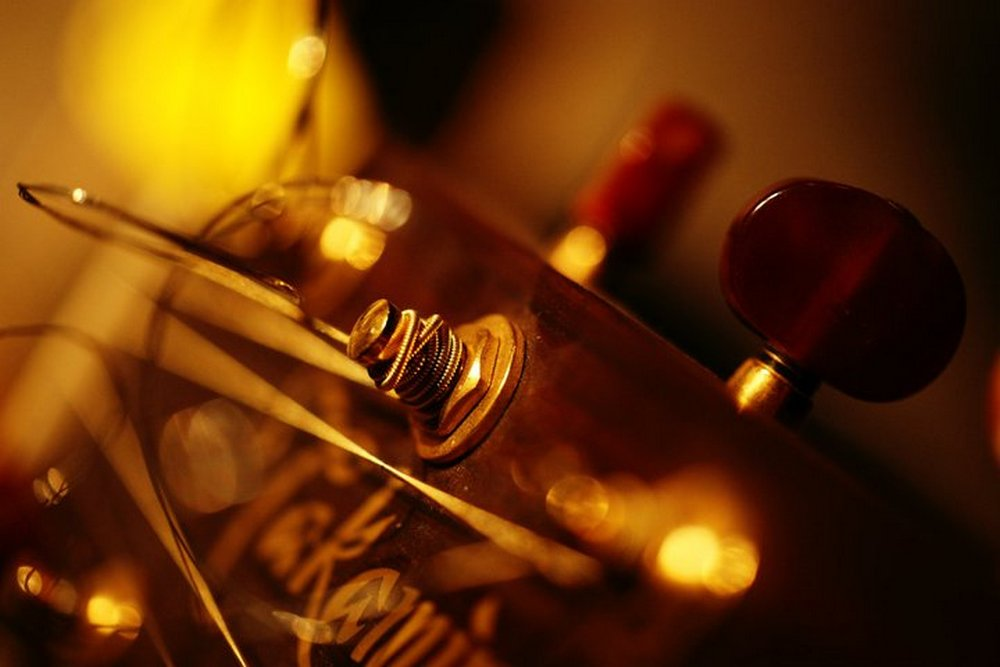
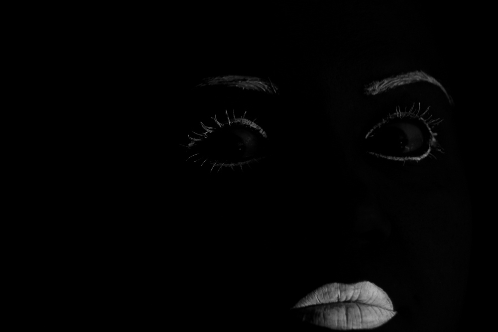
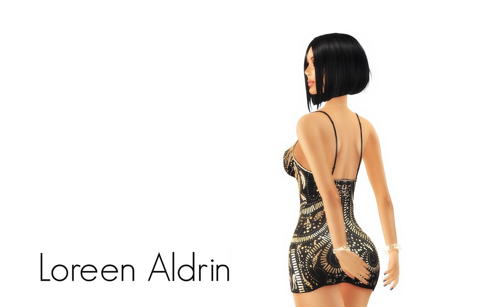
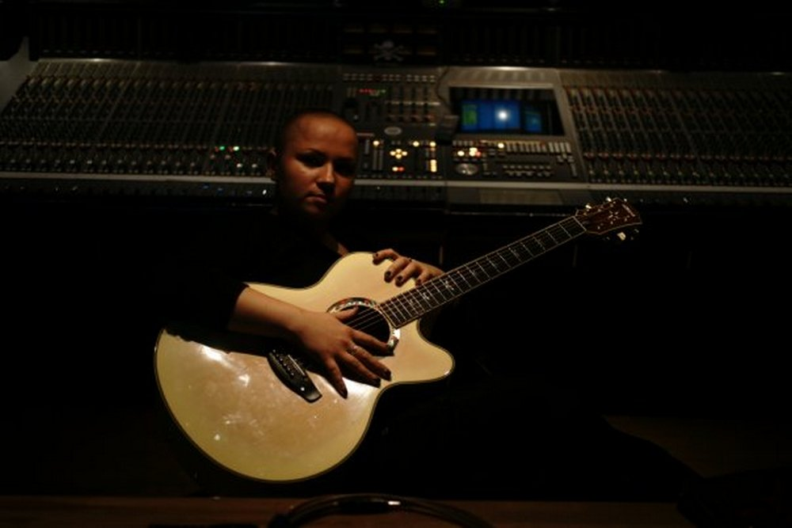

~~~
doc.title = 'OLGA ZEE'

# Uncomment to see cssId/cssClass markers in the page
#doc.view.showIdClass = True

# Page (Home)
#	Wrapper
#		Header 
#			Logo (+BurgerButton)
#			Navigation/TopMenu/MenuItem(s)
#  			Banner
#  			SlideShow (on Home)
#      		Slides
#      		SlideSide
#		Content
#			Section(s)
#				Introduction
#				Main
#				Side(s)
#		Footer
#
# ----------------------------------------
# index.html
# ----------------------------------------
page.name = 'Home'
page.url = 'index.html'
content = page.select('Content')
box = content.newBanner()
~~~
# Title about new concerts
~~~
from pagebot.constants import *
slideshow = content.newSlideShow(h=300, slideW='100%', slideH=300, startIndex=3, autoHeight=True, dynamicHeight=False, transition='slide', easing=CSS_EASE, frameDuration=4, duration=0.7, pauseOnHit=True, randomPlay=False)
box = slideshow.slides
~~~

~~~ 
box = slideshow.side
~~~
### Live shows

## The Album will be live soon

Participation requested...
~~~
section = content.newSection()
box = section.newIntroduction()
~~~

# Some blahblah about Olga

~~~
box = section.newMain() # This is the main column on the left
~~~
## Some more blahblah

more blah blah 

---

## Olga Zee bio

**Where is Siberia?** Lorem ipsum dolor sit amet, consectetur adipiscing elit, sed do eiusmod tempor incididunt ut labore et dolore magna aliqua. Ut enim ad minim veniam, quis nostrud exercitation ullamco laboris nisi ut aliquip ex ea commodo consequat. Duis aute irure dolor in reprehenderit in voluptate velit esse cillum dolore eu fugiat nulla pariatur. Excepteur sint occaecat cupidatat non proident, sunt in culpa qui officia deserunt mollit anim id est laborum.

~~~
box = section.newSide() # This is the side column on the right
~~~

## Olga Zee bio

**Where is Siberia?** Lorem ipsum dolor sit amet, consectetur adipiscing elit, sed do eiusmod tempor incididunt ut labore et dolore magna aliqua. Ut enim ad minim veniam, quis nostrud exercitation ullamco laboris nisi ut aliquip ex ea commodo consequat. Duis aute irure dolor in reprehenderit in voluptate velit esse cillum dolore eu fugiat nulla pariatur. Excepteur sint occaecat cupidatat non proident, sunt in culpa qui officia deserunt mollit anim id est laborum.

---

*[[Supporting ad in Type Magazine 3, featuring some challenging questions for future DDS-students.]]*

---

## Other music suggestions

Links to other pages in the site here.

~~~
# ----------------------------------------
# Shows/2019-shows.html
# ----------------------------------------
page = page.next
page.applyTemplate(template)  
page.name = 'Shows 2019'
page.url = 'shows2019.html' # This makes the menu

content = page.select('Content')
box = content.newBanner()
~~~
# Title of the page
~~~
section = content.newSection()
box = section.newIntroduction()
~~~

# Introduction in large size

~~~
box = section.newMain()
~~~
# Title in the main column

Lorem ipsum dolor sit amet, consectetur adipiscing elit, sed do eiusmod tempor incididunt ut labore et dolore magna aliqua. Excepteur sint occaecat cupidatat non proident, sunt in culpa qui officia deserunt mollit anim id est laborum.

---
## Other subtitle

Lorem ipsum dolor sit amet, consectetur adipiscing elit, sed do eiusmod tempor incididunt ut labore et dolore magna aliqua. Ut enim ad minim veniam, quis nostrud exercitation ullamco laboris nisi ut aliquip ex ea commodo consequat. 

~~~
section = content.newSection()
box = section.newMain()
~~~
## Other study suggestions

More navigation here

